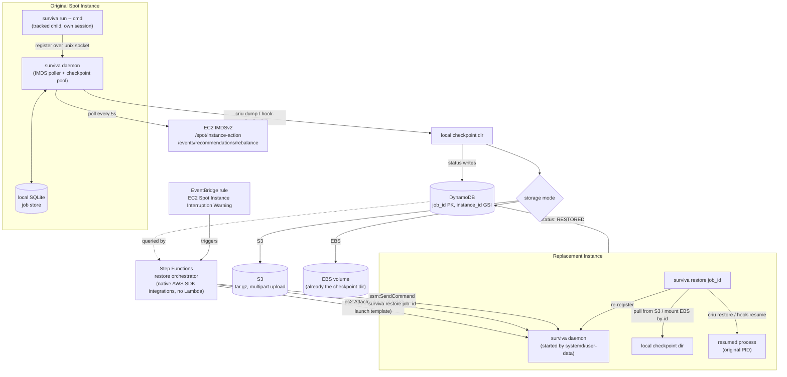

# Surviva Architecture (Technical)

System-level view of how surviva protects a long-running process against EC2 Spot
interruption. For CLI flags see [`../api-cli/technical.md`](../api-cli/technical.md); for a
per-package/per-Terraform-resource breakdown see
[`../components/technical.md`](../components/technical.md); for the reasoning behind
specific design choices see [`../design-record/technical.md`](../design-record/technical.md);
for known constraints see [`../limitations/technical.md`](../limitations/technical.md).

## End-to-end flow

## Components at a glance

| Stage | Where it runs | What it does |
|---|---|---|
| Tracking | `surviva run` (CLI) | Starts the wrapped command as its own session leader (Linux `setsid`), clears inherited fds, registers PID/PGID/hooks/priority with the daemon over a Unix socket, blocks like `time`. |
| Detection | `surviva daemon` | Polls IMDSv2 for the Spot rebalance recommendation (soft, early) and interruption notice (hard, ~2min). Either fires the checkpoint pipeline for every tracked job, and latches the daemon into refusing any *new* `surviva run` registration from that point on — a job registered after either signal has no realistic path to being checkpointed before reclamation, since each signal only ever triggers the pipeline once per daemon run. `surviva run` still runs the wrapped command either way; it just warns loudly that this one won't be protected. |
| Checkpoint | `surviva daemon` (worker pool) | Bounded by `-max-concurrent-checkpoints` (default = CPU count); jobs pulled from the local store in priority order, so constrained concurrency still checkpoints the highest-priority jobs first. Per job: `--hook-checkpoint` script, or `criu dump` (tree stopped, not left running). |
| Durability | S3 or EBS + DynamoDB | See "Storage modes" below. DynamoDB is the cross-instance source of truth; the local SQLite store only matters to the instance that wrote it. |
| Orchestration | EventBridge + Step Functions (Terraform-managed) | Reacts to the *native* AWS "EC2 Spot Instance Interruption Warning" event — surviva doesn't need to detect the interruption itself for this path, AWS already publishes it account-wide. Queries, launches, attaches, and triggers restore, entirely via AWS SDK service integrations (no Lambda). |
| Restore | `surviva restore <job-id>` (CLI, run via SSM) | Fetches checkpoint data, resumes via CRIU or hook, re-registers with the local daemon. This closes the loop: the replacement instance is now itself a "surviva run" host, protected the same way. |

## Storage modes

Configuring `-s3-bucket` or `-ebs-volume-id` (mutually exclusive, both require `-dynamodb-table`)
changes *when* the DynamoDB `IN_PROGRESS` marker is written relative to the risky operation —
the invariant held in both modes is: **the durable status record is written before the step
that could fail or be interrupted, never after**, so a mid-operation instance death is always
visible as `CHECKPOINT_IN_PROGRESS`/`CHECKPOINT_INCOMPLETE`, never silently indistinguishable
from a successful `CHECKPOINT_COMPLETE`.

- **S3 mode**: local `criu dump` completes first (fast, local disk), *then* the risky step
  (upload) begins — so the `IN_PROGRESS` record is written immediately before the tar+gzip
  streamed multipart upload (`aws-sdk-go-v2/feature/s3/manager`). Success records `s3_uri` and
  `size_bytes`; failure records `CHECKPOINT_INCOMPLETE` + `failure_reason`.
- **EBS mode**: the checkpoint directory *is* the mounted EBS volume, so the dump itself is
  the risky/slow step — the `IN_PROGRESS` record is written *before* `criu dump` starts. The
  volume's `DeleteOnTermination=false` attachment state is validated once at daemon startup
  (via `ec2:DescribeVolumes`); the daemon refuses to start otherwise. Success records
  `ebs_volume_id` and `ebs_path`.

## Orchestrator specifics

The Step Functions state machine (JSONata query language, ASL in
`infra/terraform/templates/restore_orchestrator.asl.json.tftpl`) runs, in order:

1. Fixed `Wait` (`checkpoint_wait_seconds`, default 110s) — gives the daemon's checkpoint
   pipeline time to reach a terminal state before anything is queried.
2. `dynamodb:Query` the `instance_id` GSI for every job belonging to the interrupted
   instance; filter to `status = CHECKPOINT_COMPLETE` only — anything else (still
   `IN_PROGRESS`, `INCOMPLETE`, `FAILED`) is treated as unsafe and simply skipped, not
   retried or escalated.
3. If any restorable job is `storage_type=ebs`, pin the replacement instance's subnet to
   that job's AZ via the `az_subnet_map` variable (EBS volumes are AZ-local; RunInstances
   overrides the launch template's own subnet choice).
4. `ec2:RunInstances` from the **same launch template** as the original instance (so
   AMI/kernel/instance-profile match — required for CRIU cross-instance compatibility).
5. Wait for the new instance's state to reach `running`, *then* separately wait for
   `ssm:DescribeInstanceInformation` to report `PingStatus=Online` for it — these are not
   the same moment; SSM agent registration measurably lags EC2 "running" by tens of seconds
   in practice (found during live testing, see design record).
6. Per restorable job (Step Functions `Map`, one iteration per job, all sharing the single
   new instance): if `storage_type=ebs`, `ec2:AttachVolume` and wait for `attached`; then
   `ssm:SendCommand` running `surviva restore --dynamodb-table <table> --aws-region
   <region> <job_id>` on the new instance.

The orchestrator does **not** mark jobs `RESTORED` itself — that responsibility belongs
entirely to `surviva restore`, which only sets that status once the process is verifiably
running again. (An earlier version had the orchestrator optimistically mark `RESTORED`
right after sending the SSM command; this was removed — see the design record — because it
could report success before restore had even attempted to run.)

## Recursive protection

`surviva restore` ends by re-registering the resumed process with the *local* daemon on the
replacement instance — carrying forward the job's original `hook_checkpoint`/`hook_resume`/
`priority`. The replacement instance is therefore immediately back under the same
IMDS-polling/checkpoint protection as the original. If it, too, is interrupted, the same
pipeline runs again from step one. This was exercised for real: a genuine AWS Fault
Injection Simulator experiment (`aws:ec2:send-spot-instance-interruptions`) against a live
Spot instance produced a real rebalance recommendation (handled proactively — checkpoint
completed before the harder interruption notice arrived) and a real interruption notice,
both via actual IMDS, and the full EventBridge → Step Functions → replacement instance → SSM
→ `surviva restore` chain ran with no manual intervention, ending with the original process
resumed under its **original PID** on a different physical instance.

## Known cross-cutting constraint

CRIU's regular-file restore validates that any file a process had open (e.g. stdout
redirected to a log file) exists at the *same path* with the *same recorded size* on the
restore target — a job whose output goes to an arbitrary local path that doesn't exist on
the replacement instance will fail to restore. This was found during the FIS test and is
tracked in full in [`../limitations/technical.md`](../limitations/technical.md).
